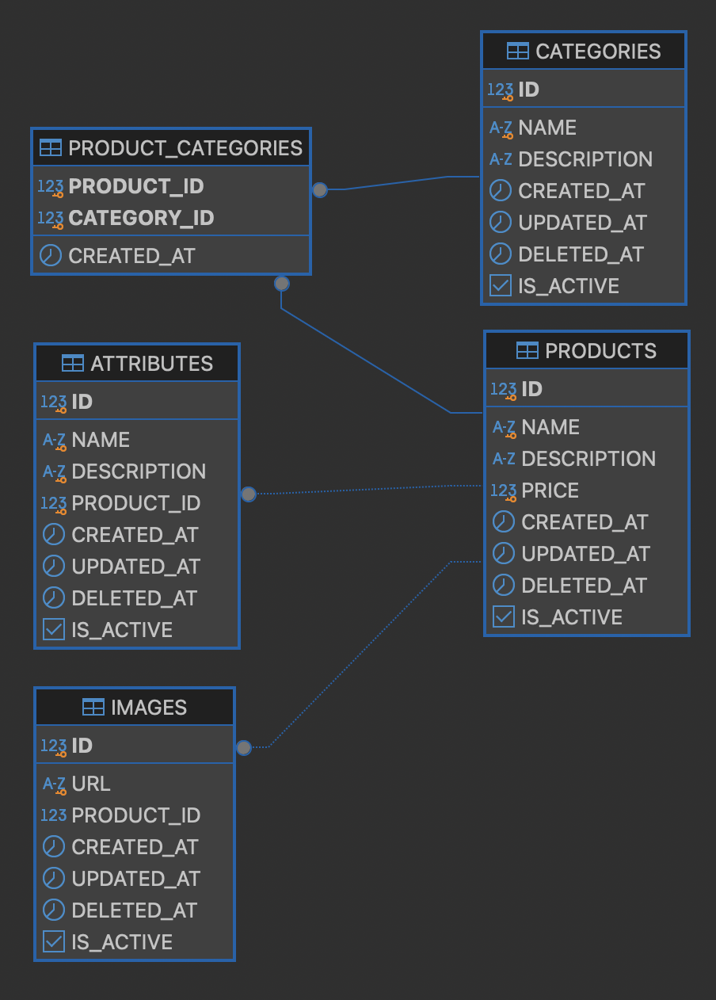
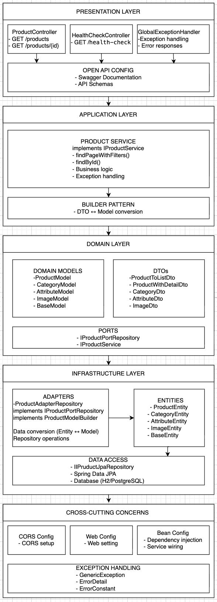

# Products API

## Tabla de contenido

- [Descripción del Proyecto](#descripción-del-proyecto)
- [Diagrama de arquitectura](#diagrama-de-base-de-datos)
- [Diagrama de arquitectura](#diagrama-de-arquitectura)
- [Instrucciones de Instalación y Ejecución](#instrucciones-de-instalación-y-ejecución)
- [Decisiones de Diseño Clave](#decisiones-de-diseño-clave)
- [Manejo de Excepciones y Logging](#manejo-de-excepciones-y-logging)
- [Consideraciones de Escalabilidad para Producción](#consideraciones-de-escalabilidad-para-producción)
- [Tecnologías Utilizadas](#tecnologías-utilizadas)
- [Contribución](#contribución)

---

## Descripción del Proyecto

Products API es una solución robusta y escalable para la gestión de productos desarrollada con Spring Boot 3.5.4 y Java 17. La API proporciona endpoints RESTful para consultar productos con capacidades de filtrado, paginación y búsqueda avanzada.

### Solución Propuesta

La API implementa una arquitectura hexagonal (puertos y adaptadores) que separa claramente la lógica de negocio de la infraestructura, facilitando el mantenimiento y las pruebas. Incluye:

- **Gestión de Productos**: Consulta de productos con filtros por nombre y categoría
- **Paginación Inteligente**: Soporte para paginación y ordenamiento dinámico
- **Filtros Avanzados**: Búsqueda por múltiples criterios
- **Documentación Automática**: API documentada con OpenAPI 3.0
- **Manejo de Errores**: Sistema robusto de excepciones y logging

## Diagrama de base de datos


## Diagrama de arquitectura


## Instrucciones de Instalación y Ejecución

### Prerrequisitos

- Java 17 o superior
- Maven 3.6+
- Git

### Clonación del Proyecto

```bash
git clone https://github.com/Ing-Erick-Mtz-Electronico/api-spring-boot-mvc
cd api-spring-boot-mvc
```

### Ejecución Local

1. **Compilar el proyecto:**
   ```bash
   mvn clean compile
   ```

2. **Ejecutar la aplicación:**
   ```bash
   mvn spring-boot:run
   ```

3. **Acceder a la API:**
   - Base URL: `http://localhost:8080/api/v1`
   - Documentación Swagger: `http://localhost:8080/api/v1/swagger-ui.html`

### Ejecutar Tests con Cobertura
```bash
# Ejecutar tests y generar reporte de cobertura
mvn clean test jacoco:report

# Verificar que la cobertura sea al menos 80%
mvn clean test jacoco:check

# Solo generar reporte (si los tests ya se ejecutaron)
mvn jacoco:report
```

### Reportes de Cobertura
Los reportes de cobertura se generan en:
- **HTML**: `target/site/jacoco/index.html`
- **XML**: `target/site/jacoco/jacoco.xml`
- **CSV**: `target/site/jacoco/jacoco.csv`

### Metas de Cobertura
- **Líneas de código**: Mínimo 80%

## Decisiones de Diseño Clave

### 1. Arquitectura Hexagonal (Puertos y Adaptadores)

La aplicación implementa una arquitectura hexagonal que separa:
- **Dominio**: Modelos de negocio (`ProductModel`, `CategoryModel`)
- **Puertos**: Interfaces de servicio y repositorio (`IProductService`, `IProductPortRepository`)
- **Adaptadores**: Implementaciones concretas (`ProductService`, `ProductAdapterRepository`)

**Beneficios:**
- Desacoplamiento entre capas
- Facilita el testing unitario
- Permite cambios de infraestructura sin afectar la lógica de negocio

### 2. Patrón Builder

Utilizamos el patrón Builder con Lombok para:
- Construcción fluida de objetos complejos
- Inmutabilidad en DTOs de respuesta
- Conversión eficiente entre entidades y modelos

### 3. Separación de Responsabilidades

- **Controllers**: Manejo de requests HTTP y validación de entrada
- **Services**: Lógica de negocio y orquestación
- **Repositories**: Acceso a datos y mapeo de entidades
- **DTOs**: Transferencia de datos optimizada para cada caso de uso

### 4. Configuración Modular

- **CORS**: Configuración flexible para diferentes entornos
- **OpenAPI**: Documentación automática y esquemas de respuesta
- **Logging**: Configuración centralizada con rotación de archivos

## Manejo de Excepciones y Logging

### Sistema de Excepciones

1. **Excepciones Personalizadas:**
   - `GenericException`: Para errores de negocio controlados
   - `ErrorDetail`: DTO estandarizado para respuestas de error

2. **Manejo Global:**
   - `GlobalExceptionHandlerMvc`: Captura todas las excepciones no manejadas
   - Respuestas HTTP consistentes con códigos de estado apropiados
   - Logging automático de errores con contexto completo

### Estrategia de Logging

1. **Configuración:**
   - Nivel INFO para la aplicación principal
   - Nivel WARN para Spring Web
   - Nivel DEBUG para consultas SQL (desarrollo)

2. **Rotación de Logs:**
   - Archivo principal: `logs/api.log`
   - Tamaño máximo por archivo: 10MB
   - Historial: 30 archivos

3. **Patrones de Log:**
   - Consola: Formato simplificado para desarrollo
   - Archivo: Formato detallado con timestamp, thread y logger

4. **Logging Estratégico:**
   - Operaciones de negocio (búsquedas, filtros)
   - Errores con contexto completo
   - Performance de operaciones críticas

## Consideraciones de Escalabilidad para Producción

### 1. Base de Datos

**Actual:**
- H2 en memoria (desarrollo)
- JPA con Hibernate

**Producción:**
- PostgreSQL o MySQL para persistencia
- Connection pooling configurado (HikariCP)
- Índices optimizados para consultas frecuentes
- Read replicas para operaciones de lectura

### 2. Caché

**Implementar:**
- Redis para caché de productos frecuentemente consultados
- Caché de segundo nivel en Hibernate
- Invalidación inteligente de caché

### 3. Performance

**Optimizaciones:**
- Paginación eficiente con índices de base de datos
- DTOs optimizados por endpoint
- Compresión de respuestas HTTP

### 4. Seguridad

**Implementar:**
- Autenticación JWT
- Rate limiting por IP/usuario
- Validación de entrada robusta
- HTTPS obligatorio

### 5. Despliegue

**Estrategia:**
- Contenedores Docker con imágenes optimizadas
- Orquestación con Kubernetes
- Auto-scaling basado en métricas
- Load balancing con múltiples instancias

### 6. Resiliencia

**Patrones:**
- Circuit breaker para llamadas externas
- Retry policies con backoff exponencial
- Timeout configurables por operación
- Fallback strategies para operaciones críticas

## Tecnologías Utilizadas

- **Framework**: Spring Boot 3.5.4
- **Java**: 17
- **Base de Datos**: H2 (desarrollo), PostgreSQL (producción)
- **ORM**: Spring Data JPA + Hibernate
- **Documentación**: OpenAPI 3.0 + Swagger UI
- **Testing**: JUnit 5 + Mockito
- **Build Tool**: Maven
- **Lombok**: Reducción de código boilerplate

## Contribución

1. Fork el proyecto
2. Crea una rama para tu feature (`git checkout -b feature/AmazingFeature`)
3. Commit tus cambios (`git commit -m 'Add some AmazingFeature'`)
4. Push a la rama (`git push origin feature/AmazingFeature`)
5. Abre un Pull Request

